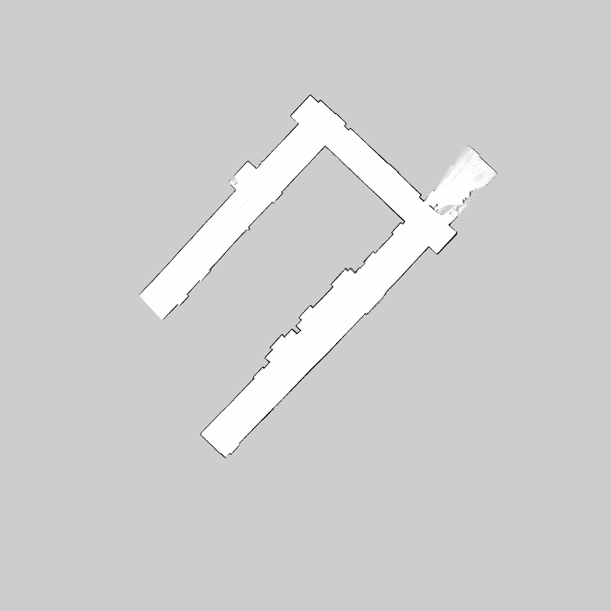
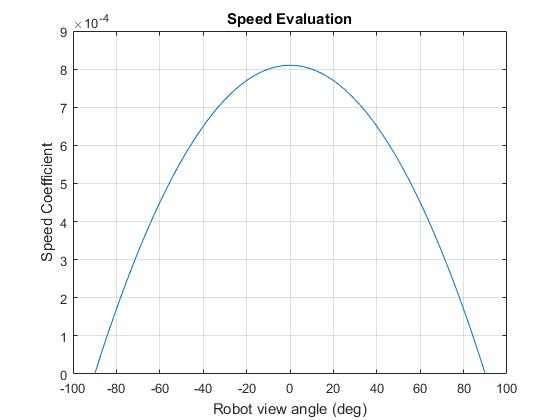
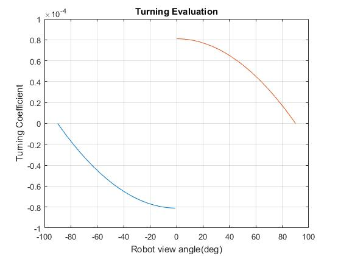
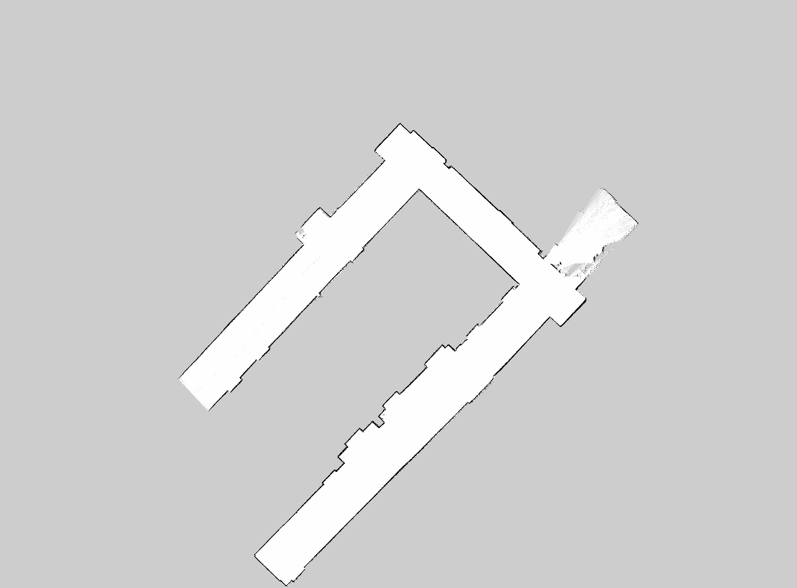

# Building Exploration

- Teams should develop a URDF model for the LMS200/291. You may assume the mass of the LIDAR to be uniform.
- Add the URDF model to the Jackal Description.
- Define an appropriate TF in which to publish 'laser scan' data from the SICK.
- Use the SICK Toolbox wrapper to publish LIDAR data in this reference frame.
- Demonstrate operation of the Jackal and LIDAR using rviz.
- You should assume you will have no Wi-Fi connectivity. Start the Jackal moving randomly or following some pattern for a predefined time.
- Document your approach, use of the package, and describe your strategy on the github wiki page.
- Present a map of a floor on the EERC. Include this map on your github wiki page.
- Demonstrate operation of your mapping program at a TBD location after presentations on March 1.

## Completed Jackal connection Tutorial
- [x] [Ian Wakely](https://github.com/raveious) (Project Leader)
- [x] [Phillip Scramlin](https://github.com/pdscraml)
- [x] [Akhil Kurup](https://github.com/amkurup)

## Local Development

After cloning this repository, follow these steps to setup the development environment
```
$ cd catkin_ws/src
$ catkin_init_workspace
$ cd ..
$ catkin_make
$ source devel/setup.bash
```

### Viewing the robot model

Make sure to source all of setup scripts, this will setup all the paths for your local environment.

```
$ source catkin_ws/devel/setup.bash
$ source catkin_ws/remote-jackal.sh
```

View the model via roslaunch and Rviz

```
$ roslaunch building_mapper view_model.launch
```

### Exploration with the Jackal

Once the Jackal is powered up and online, ssh into it and launch the exploration nodes.

```
$ ssh jackal2
$ cd building-exploration/catkin_ws
$ git pull
$ source devel/setup.bash
$ roslaunch building_mapper exploration.launch
```

On your local machine, set the ROS master target to the Jackal.

```
$ source catkin_ws/remote-jackal.sh jackal2
```

This will setup everything up to have all your nodes use Jackal 2 as your master node. To view the visualized data from the sensors, use roslaunch on your local machine.

```
$ source catkin_ws/devel/setup.bash
$ roslaunch building_mapper view_remote_robot.launch
```

### Launch files

Name|Description
:---|:---:
[exploration](catkin_ws/src/building_mapper/launch/exploration.launch)|Main experiment of exploration. This launches everything that the Jackal needs in order to run our exploration routines like the SICK LIDAR and controllers, in addition to our exploration nodes. This is intended to be launched on the Jackal.
[jackal](catkin_ws/src/building_mapper/launch/jackal.launch)|Self contained launch file that will launch all the sensors, their drivers or supporting nodes. This doesn't include any nodes that will cause the robot to move, simply creates a platform to conduct higher order functions. This is intended to be launched on the Jackal.
[sicklms](catkin_ws/src/building_mapper/launch/sicklms.launch)|Configures and launches all nodes that are necessary for the SICK lm2xx LIDAR, the LIDAR we're using for out experiments. This is intended to be launched on the Jackal.
[teleop](catkin_ws/src/building_mapper/launch/teleop.launch)|Testing launch file that records all the data while allowing for teleoperation. This is intended to be launched on the Jackal.
[view_model](catkin_ws/src/building_mapper/launch/view_model.launch)|Allows for the viewing of the Jackal model with all of the additional sensors. No actual control is available.This is intended to be launched on your local machine.
[view_remote_robot](catkin_ws/src/building_mapper/launch/view_remote_robot.launch)|Allows for the viewing of the Jackal model and visualizes all of the additional sensor data. This is intended to be launched on your local machine **and the controllers should already be launched on the Jackal.**
[view_robot](catkin_ws/src/building_mapper/launch/view_robot.launch)|Allows for the viewing of the Jackal model and visualizes all of the additional sensor data. This is intended to be launched on your local machine **and the controllers will be launched on your local machine.**
[replay](catkin_ws/src/building_mapper/launch/replay.launch)|To be used for map creation. Launches gmapping with SLAM mapping and other configuration settings, followed by rviz. A python script is then launched for the playing back of rosbag data and map generation with map_saver. Intended to be run on local machine. Rosbag data must be copied from jackal after running exploration launch file.

## Exploration Algorithms

During the course of this project, we developed two methods of interpreting movements for the Jackal which were both based on the SICK LIDAR lm2xx input. These algorithms are centered around the idea of following a wall around the building.

### Discrete Wall Avoidence
By [Akhil Kurup](https://github.com/amkurup)
Source: [jackal_move.py](catkin_ws/src/building_mapper/scripts/jackal_move.py)

Uses scan data from the SICK-LMS200 to detect proximity from/to a wall and decide the next step to be taken. 3 major points are scanned: forward (90), left (170) and right (10). If the robot gets close to walls, the left and right points go below 0.9mtr and it turns the other way. If a wall is encountered dead ahead, it scans left and right and makes a decision to turn based on distance from obstacles.

Resulting Map:


> Advantages: fast

> Disadvantages: crude, follows a zig-zag path, jerks

<a href="https://www.youtube.com/watch?v=SlaGViP3a7M" target="_blank"></a>

### Continuous Wall Avoidence
By [Ian Wakely](https://github.com/raveious)
Source: [wall_avoid.py](catkin_ws/src/building_mapper/scripts/wall_avoid.py)

Uses quadratic functions to evaluate the importance of a particular range value read from the LIDAR and evaluates every points along the scan to come to a desired action of avoidence. It multiplies each of the range values by speed and turning coefficiencts and sums the results into a resulting turning and speed action.



When the area in front of the robot is more open, then it will increase its speed and slow down when it is less open for tight maneuvering.



When the area to the left is more occupied, turn right. When the right side is more occupied, turn left.

Resulting Map:


> Advantages: Smooth turning and speed control

> Disadvantages: Complex, slow

<a href="https://www.youtube.com/watch?v=ek8rpRBjwkk" target="_blank"></a>

<a href="https://www.youtube.com/watch?v=nWGagJHPpIU" target="_blank"></a>
